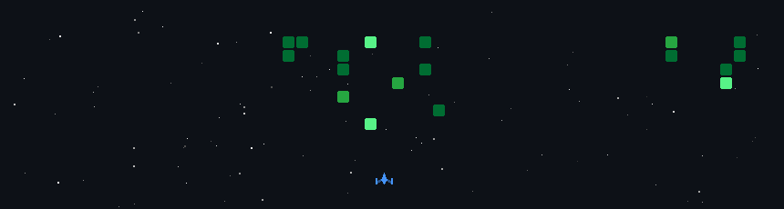

  

<h2 align="center">Hi, I'm Ade Rainhard</h2>

  <strong>Full Stack Web Developer</strong> | Telkom University | Bandung, Indonesia

  <a href="https://rainhard.my.id">Website</a> |
  <a href="https://www.instagram.com/aderainhard">Instagram</a> |
  <a href="https://www.linkedin.com/in/ade-rainhard-pasaribu-42426432a">LinkedIn</a> |
  <a href="https://www.tiktok.com/@ashlxy8?is_from_webapp=1&sender_device=pc">TikTok</a>

I'm Ade Rainhard Pasaribu, a student at **Telkom University** based in **Bandung, Indonesia**. I build modern web applications with a focus on clean interfaces, strong frontend architecture, reliable backend logic, and interactive digital experiences.

I enjoy working across the full stack: designing polished UI, building APIs, integrating databases, experimenting with 3D/animation, and deploying production-ready apps. My goal is to create products that feel professional, fast, and useful.

### Core Tech Stacks

### Other Tech Stacks

### Tools

### Currently Learning

### Statistics

  

  

  
  

  
  

